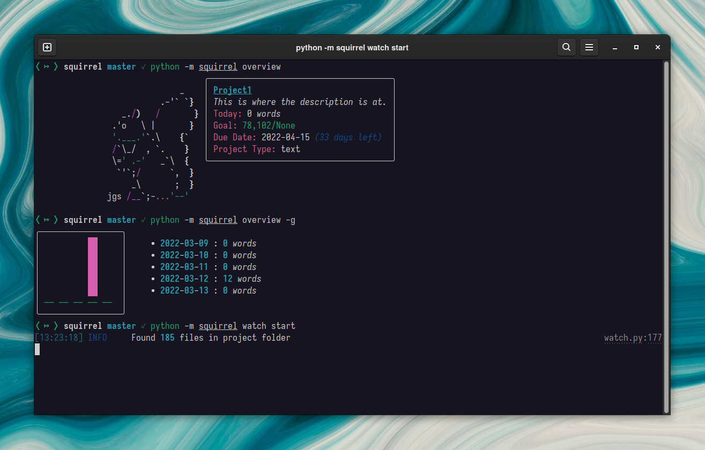

# Squirrel
**Very much a WIP project**

squirrel is a command line program that tracks you writing progress and gives you useful information and cute pictures of squirrels.

## How it works
Squirrel's design was inspired by `git`'s design (from a user perspective at least). To start a project, you have to initialize a new project in your directory of choice which will create a `.squirrel` folder structure in your directory similar to `.git` directories.
And that folder will hold information about the project in general and the word counts.
However `squirrel` is not a static program otherwise we wouldn't be able to track progress without explicit input of the user. That's why we need to have a `watch` command that will listen to any changes and update the appropriate information.

### Plugins or Project Types
As many writing project use many file formats and programs, squirrel has a plugin architecture to have many ways to count words.
Which plugin will used depends on the `project-type` field.
Here are the plugins available now:
* text

*hmm, haven't found your project type? you can write Python code? Please make a pull request :)*

## Installation
### Users
*Coming soon*
### Devs
Grab the repo, install dependencies, and voila.
```sh
git clone https://github.com/squirrel-writer/squirrel
cd squirrel
pipenv install && pipenv shell
python -m squirrel init
```
## Usage
There 4 main verbs to interact with squirrel:
* init
* watch
* set
* overview

You can about their options with `-h` or `--help` option. (e.g `squirrel init -h`, etc.)
### Init
```sh
squirrel init -n Assay --project-type text
```
### Set
Set can be used after init to change or set fields.
```sh
squirrel set --name "English Assay" --goal 10000 -due 05/01/2022
```
### Watch
Run this command to tell squirrel to watch your writing.
```sh
squirrel watch start --daemon
squirrel watch status
squirrel watch stop
```
